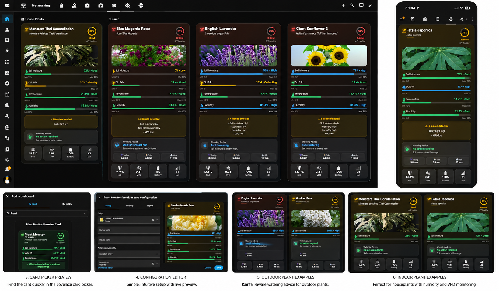
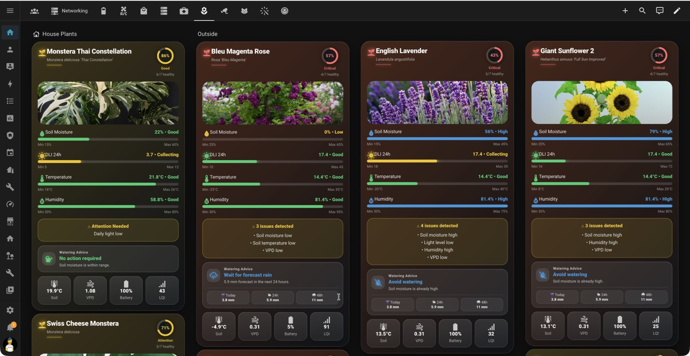
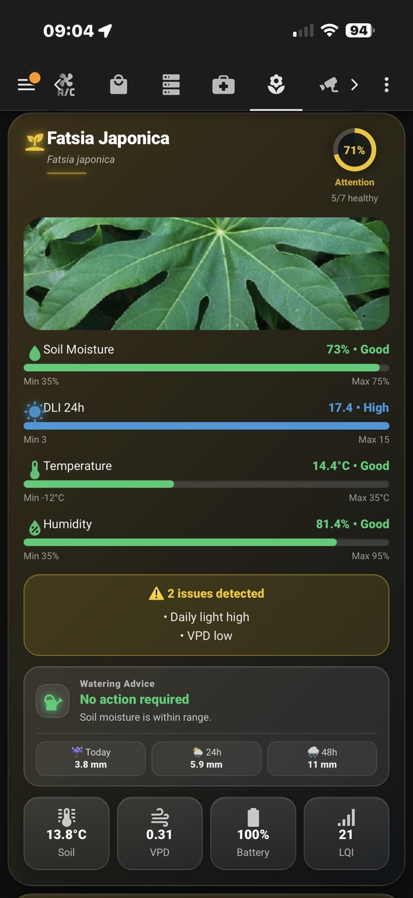
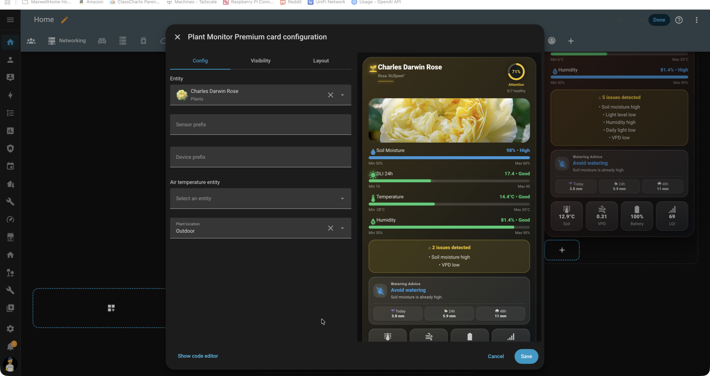
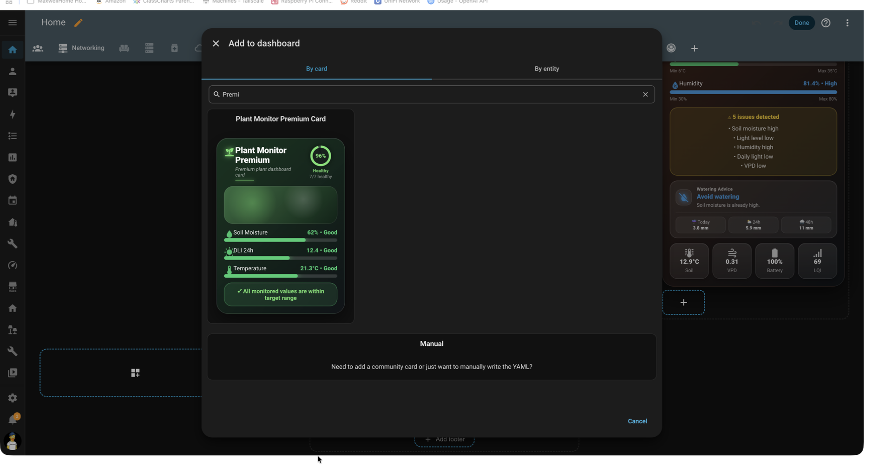
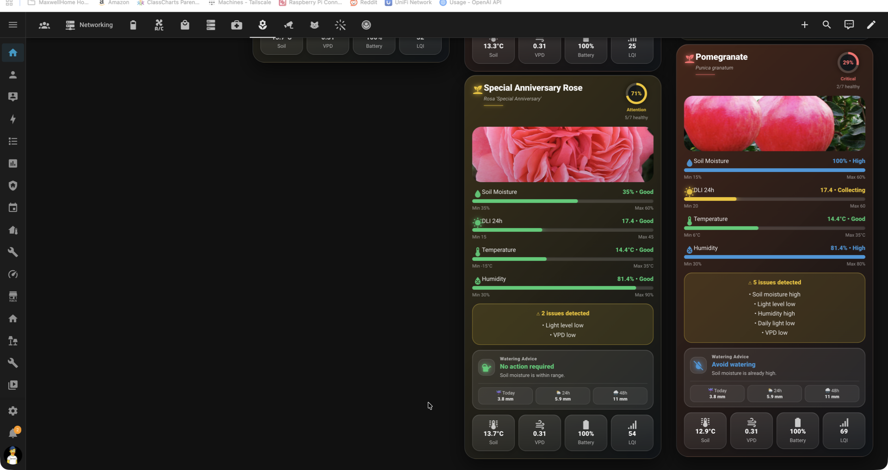
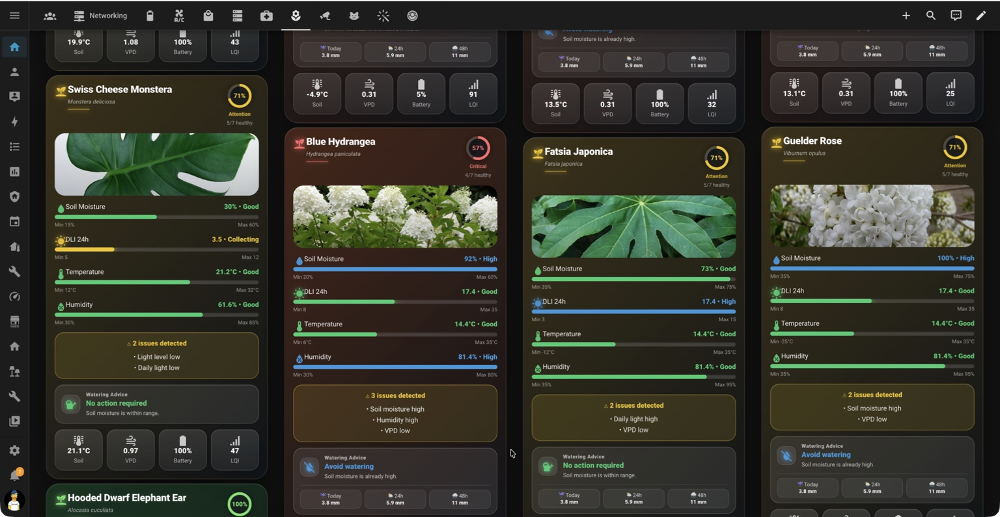

# Plant Monitor Premium Card

A premium Home Assistant card for Plant Monitor featuring OpenPlantBook integration, DLI-based light monitoring, rainfall-aware watering advice, mobile responsive layouts and a visual configuration editor.

---

## Features

- Plant Monitor integration support
- OpenPlantBook species information
- Indoor and outdoor plant support
- DLI (Daily Light Integral) monitoring
- Rainfall-aware watering advice
- Dynamic health scoring
- Mobile responsive design
- Visual configuration editor
- Lovelace card picker preview
- Battery and Link Quality (LQI) support
- Soil moisture monitoring
- Temperature monitoring
- Humidity monitoring
- Soil temperature monitoring
- VPD monitoring
- Graceful degradation when optional sensors are unavailable
- Optimised for large plant collections
- HACS compatible

---

## Screenshots

### Desktop Dashboard

Monitor multiple plants simultaneously with health scoring, alerts and watering recommendations.

---

### Mobile View

Fully responsive layout designed for Home Assistant mobile apps.

---

### Configuration Editor

Simple visual configuration with live preview.

---

### Card Picker Preview

Easy discovery from the Lovelace card picker.

---

### Outdoor Plant Monitoring

Rainfall-aware watering advice for outdoor plants.

---

### Multiple Plant Dashboard

Designed to support large plant collections while remaining responsive.

---

## Highlights

### Plant Health Score

The card calculates a dynamic health score using Plant Monitor status attributes:

- Soil Moisture
- Temperature
- Humidity
- Illuminance / DLI
- Soil Temperature
- VPD

Health states:

| Score | Status |
|---------|---------|
| 90–100% | Excellent |
| 70–89% | Attention |
| Below 70% | Critical |

---

### DLI-Based Lighting

Unlike many plant dashboards that rely solely on lux values, Plant Monitor Premium uses Daily Light Integral (DLI) wherever available.

Benefits:

- More accurate assessment of plant light exposure
- Better support for indoor grow lighting
- Better support for outdoor plants
- Avoids misleading lux readings

---

### Rainfall-Aware Watering Advice

Outdoor plants can incorporate rainfall sensors to generate intelligent watering recommendations:

- Water today
- Wait for forecast rain
- Avoid watering
- No action required

---

## Requirements

### Required Integrations

- Plant Monitor (custom integration)
- OpenPlantBook

### Recommended Integrations

- Pirate Weather
- HA-Illuminance
- Zigbee2MQTT

---

## Installation

See:

- docs/installation.md
- docs/rainfall-sensors.md
- docs/sensor-hardware.md
- docs/troubleshooting.md

---

## Tested Environment

The card has been tested with:

- Home Assistant
- Plant Monitor (custom integration)
- OpenPlantBook
- Pirate Weather
- HA-Illuminance
- Zigbee2MQTT

Hardware used during development:

- Tuya Zigbee soil sensors
- HOBEIAN ZG-303Z
- COOLQO CS-201Z
- Outdoor plants using public illuminance estimates
- Indoor plants using physical sensors

---

## License

MIT License

---

## Changelog

See CHANGELOG.md
